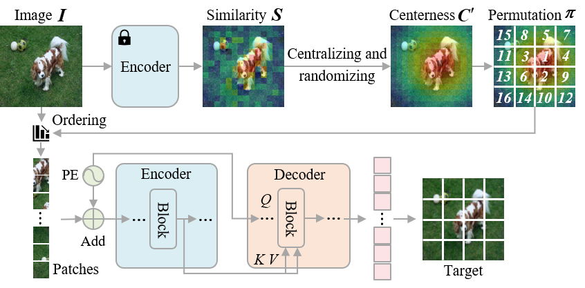

# SemAIM
Official PyTorch Implementation of [Semantic-Aware Autoregressive Image Modeling for Visual Representation Learning](https://arxiv.org/abs/2312.xxxx), Accepted by AAAI 2024.
## Introduction


**SemAIM** is a novel autoregressive image modeling method for self-supervised learning. The key insight of SemAIM is to autoregressive model images from the semantic patches to the less semantic patches.

## Main Results on ImageNet-1k

The results of Finetune Accuracy (%) on ImageNet-1k are as following:

|  Models  | Pretrain Epochs |   ViT-B     |    ViT-L    |
| :------: | :-------------: | :---------: | :---------: |
|   DINO   |       800       |    82.8     |     -       |
|   BEiT   |       800       |    83.2     |     85.2    |
|   MAE    |      1600       |    83.6     |     85.9    |
|  SimMIM  |      1600       |    83.8     |     -       |
| LocalMIM |      1600       |    84.0     |     -       |
|   HPM    |       800       |    84.2     |     85.8    |
|   iGPT   |        -        |    72.6     |     -       |
| ViT-iGPT |       300       |    82.7     |     -       |
| RandSAC  |      1600       |    83.9     |     -       |
|   SAIM   |       800       |    83.9     |     -       |
|  SemAIM  |       400       |    83.8     |     85.5    |
|  SemAIM  |       800       |    84.1     |     85.8    |
|  SemAIM* |       800       |  **85.3**   |   **86.5**  |

* means using CLIP feature as predict targets.

## Getting Started

### Install
- Clone this repo:

```bash
git clone https://github.com/skyoux/SemAIM
cd SemAIM
```

- Create a conda environment and activate it:
```bash
conda create -n semaim python=3.9
conda activate semaim
```

- Install `Pytorch==1.13.0` and `torchvision==0.14.0` with `CUDA==11.6`

```bash
conda install pytorch torchvision torchaudio pytorch-cuda=11.6 -c pytorch -c nvidia
```

- Install `timm==0.4.5`

```bash
pip install timm==0.4.5
```

### Data preparation

You can download the ImageNet-1K [here](https://image-net.org) and prepare the ImageNet-1K follow this format:
```tree data
imagenet
  ├── train
  │   ├── class1
  │   │   ├── img1.jpeg
  │   │   ├── img2.jpeg
  │   │   └── ...
  │   ├── class2
  │   │   ├── img3.jpeg
  │   │   └── ...
  │   └── ...
  └── val
      ├── class1
      │   ├── img4.jpeg
      │   ├── img5.jpeg
      │   └── ...
      ├── class2
      │   ├── img6.jpeg
      │   └── ...
      └── ...
```

### Pretrain
```shell
python -m torch.distributed.launch --nproc_per_node 8 --nnodes 4 --node_rank 0 \
    main_pretrain.py \
    --batch_size 64 --epochs 800 --accum_iter 1 \
    --model aim_base --query_depth 12 --prediction_head_type MLP \
    --gaussian_kernel_size 9 --gaussian_sigma 1 --norm_pix_loss \
    --permutation_type attention_center --attention_type cls \
    --blr 2e-4 --warmup_epochs 30 --weight_decay 0.05 --clip_grad 3 \
    --data_path <imagenet-path> --output_dir <output-directory> \
    --log_dir <log-directory --experiment exp0 \
```

### Finetune
```shell
python -m torch.distributed.launch --nproc_per_node 8 --nnodes 2 --node_rank 0 \
    main_finetune.py \
    --model vit_base_patch16 --batch_size 64 --accum_iter 1 \
    --blr 5e-4 --layer_decay 0.65 --epochs 100 --warmup_epochs 20 \
    --weight_decay 0.05 --drop_path 0.1 --reprob 0.25 --mixup 0.8 --cutmix 1.0 \
    --dist_eval --data_path <imagenet-path> \
    --finetune <pretrained-ckpt> --output_dir <output-directory> \
    --log_dir <log-directory --experiment exp0 \
```

### Linear Probing
```shell
python -m torch.distributed.launch --nproc_per_node 8 main_linprobe.py \
    --model vit_base_patch16 --cls_token --batch_size 512 \
    --blr 0.1 --epochs 90 --warmup_epochs 0 --weight_decay 0.0 \
    --dist_eval --data_path <imagenet-path> \
    --finetune <pretrained-ckpt> --output_dir <output-directory> \
    --log_dir <log-directory --experiment exp0 \
```

### Linear Probing
```shell
python3 -m torch.distributed.launch --nproc_per_node=8 main_knn.py \
--model vit_large_patch16 --global_pool \
--batch_size_per_gpu 512 \
--pretrained_weights <pretrained-ckpt> \
--checkpoint_key state_dict \
--data_path <imagenet-path> \
--use_cuda \
```

## Visualization


Visualization of different autoregression orders. (a) input images, (b) raster order used in iGPT, (c) stochastic order used in SAIM, (d) similarity order (the similarity map is directly used as the autoregression order), and (e) semantic-aware order used in SemAIM. In (b)(c)(d)(e), the first column shows the self-attention maps from the last block, the second column shows similarity maps from the last block, and the last column shows the corresponding autoregression orders (more warm-colored patches are predicted first).
The self-attention maps and the similarity maps of the semantic-aware order used in SemAIM locate on semantic regions more accurately than
other methods. This indicates that SemAIM can learn more semantic representations.

## Acknowledgement

This project is based on [SAIM](https://github.com/qiy20/SAIM), [DeiT](https://github.com/facebookresearch/deit), [BEiT](https://github.com/microsoft/unilm/tree/master/beit), [MAE](https://github.com/facebookresearch/mae), and [DINO](https://github.com/facebookresearch/dino).

## LICENSE

SemAIM is released under the [MIT License](./LICENSE).

## Citation

```
@inproceedings{song2023semantic,
  title={Semantic-Aware Autoregressive Image Modeling for Visual Representation Learning},
  author={Song, Kaiyou and Zhang, Shan and Wang, Tong},
  booktitle={Proceedings of the AAAI Conference on Artificial Intelligence},
  volume={37},
  number={2},
  pages={2074--2081},
  year={2024}
}
```

